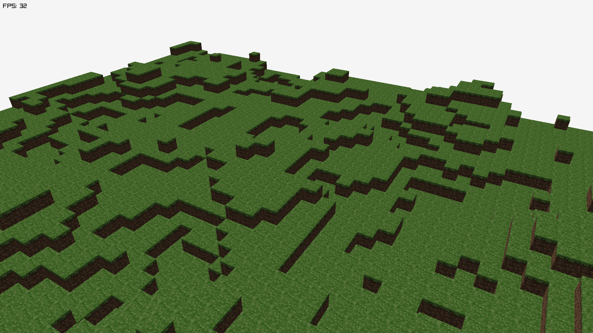

# mc-go

A Minecraft-style voxel engine written in Go using [raylib-go](https://github.com/gen2brain/raylib-go).

## Features

- ✅ Single chunk procedural terrain generation using Perlin noise
- ✅ Efficient block face culling to avoid rendering hidden faces
- ✅ Basic block rendering system with support for different block types
- ⚠️ Currently renders each block individually — optimization needed to combine chunk into a single mesh for better performance



## Getting Started

Make sure you have Go and [raylib-go](https://github.com/gen2brain/raylib-go) set up correctly.

```bash
go run cmd/main.go
```
